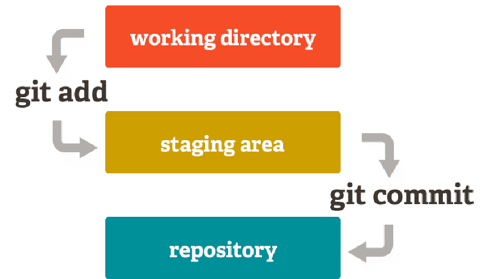

Rozdział 1: Wprowadzenie do świata Git
======================================

W dzisiejszym świecie tworzenia oprogramowania, efektywne zarządzanie
kodem źródłowym jest kluczowe dla sukcesu każdego projektu, niezależnie
od jego skali. Systemy kontroli wersji stały się nieodzownym narzędziem
w codziennej pracy programistów. W tym rozdziale przyjrzymy się bliżej
najpopularniejszemu z nich – Gitowi.

**Czym jest System Kontroli Wersji (VCS)?**
-------------------------------------------

System kontroli wersji (ang. *Version Control System*, VCS) to rodzaj
oprogramowania, które śledzi i rejestruje zmiany wprowadzane w plikach w
czasie. Pozwala to użytkownikom na przywołanie określonych wersji plików
z przeszłości, porównywanie zmian wprowadzonych w różnym czasie,
sprawdzenie, kto ostatnio zmodyfikował coś, co mogło spowodować problem,
oraz wiele innych.

Wyobraź sobie, że piszesz ważną pracę dyplomową. Zapisujesz kolejne
wersje pliku jako "praca_v1.docx", "praca_v2_poprawki.docx",
"praca_FINALNA.docx", "praca_FINALNA_naprawde.docx". To jest prymitywna
forma kontroli wersji. VCS automatyzuje ten proces, robiąc to znacznie
wydajniej i bezpieczniej, przechowując tylko różnice między wersjami, a
nie całe kopie plików.

**Dlaczego Git zdominował rynek?**
----------------------------------

Git został stworzony w 2005 roku przez Linusa Torvaldsa na potrzeby
rozwoju jądra Linux. Od tego czasu stał się standardem *de facto* w
branży. Co wpłynęło na jego sukces?

-  **Rozproszona architektura (DVCS):** W przeciwieństwie do starszych,
   scentralizowanych systemów (jak SVN czy CVS), w Gicie każdy
   użytkownik posiada pełną kopię repozytorium, wraz z całą jego
   historią. Daje to ogromną niezależność, umożliwia pracę offline i
   zwiększa bezpieczeństwo (każda kopia jest pełnym backupem).

-  **Wydajność:** Git jest niezwykle szybki. Operacje takie jak
   przeglądanie historii, tworzenie gałęzi czy przełączanie się między
   nimi, odbywają się niemal natychmiastowo, ponieważ operują na danych
   lokalnych.

-  **Integralność danych:** Git używa sum kontrolnych SHA-1 do
   identyfikacji wszystkiego w swojej bazie danych. Zapewnia to, że
   niemożliwa jest zmiana treści pliku lub historii bez wiedzy Gita.

-  **Wsparcie dla nieliniowego rozwoju:** Git został zaprojektowany z
   myślą o łatwym tworzeniu i łączeniu gałęzi (branching & merging).
   Umożliwia to równoległą pracę nad wieloma funkcjonalnościami bez
   ryzyka destabilizacji głównej wersji kodu.

**Architektura Gita w skrócie**
-------------------------------

Poniższa ilustracja przedstawia uproszczony schemat działania Gita,
pokazując przepływ danych między katalogiem roboczym, poczekalnią
(staging area) a repozytorium.

   *Rys. 1 Uproszczony przeplyw pracy w systemie Git.*
